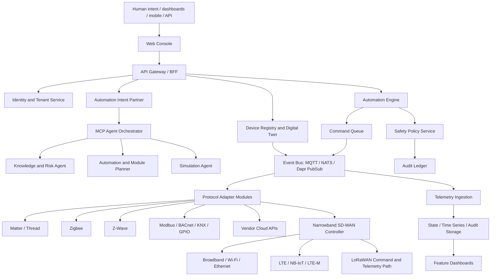
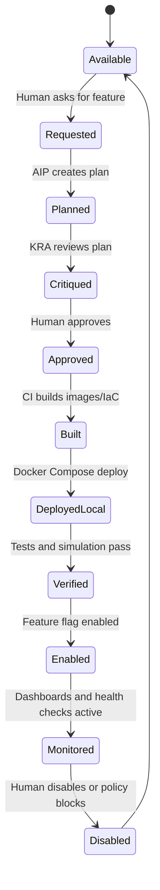
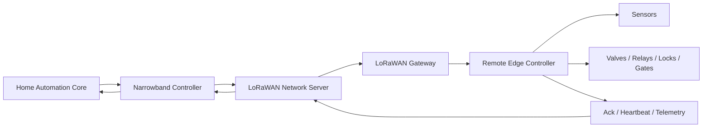

# EdgeCommand Control Fabric Product Blueprint

Working title: **EdgeCommand Control Fabric**

Date: 2026-05-10

This document defines the target product, architecture, module model, agent model, narrowband SD-WAN concept, dashboards, services, and build strategy for a modular home automation platform that can control and automate IP-connected devices, bridge non-IP sensor networks, and operate across constrained remote links.

The DIIaC reference product is treated as read-only inspiration. The pattern to reuse is conceptual: a human-intent partner proposes actions, a research/risk agent critiques and grounds them, governed dashboards make system health visible, and high-risk changes require explicit human approval.

## Product Ambition

Build the most capable local-first and cloud-extendable home automation platform available:

- Control IP, mesh, wired, cloud, RF/IR, and sensor-based devices through modular adapters.
- Turn natural language into safe, auditable automation through MCP-style agents.
- Keep critical home, building, estate, and remote-site controls working during internet failure.
- Introduce a first-of-kind **Semantic Narrowband SD-WAN** that routes automation intent and telemetry over broadband, LTE, NB-IoT, LTE-M, and LoRaWAN-class links.
- Make every major capability a clean feature module that can be requested by a human, planned by agents, built through IaC, deployed locally, validated, and then promoted to Azure.

This should not be "another smart home dashboard." It should be a governed automation operating system for homes, estates, buildings, remote assets, and future IoT environments.

## Core Design Principles

1. **Local-first control**
   Critical automations must run at the edge even when cloud, broadband, or identity providers are unavailable.

2. **Cloud-extendable operations**
   Azure hosts identity, management, observability, remote access, module deployment, tenant control, and fleet-scale services.

3. **Intent before implementation**
   Users express outcomes. Agents convert intent into proposed automations, device commands, policies, scenes, or module plans.

4. **AIP proposes, KRA critiques**
   The Automation Intent Partner proposes. The Knowledge and Risk Agent grounds, checks, warns, and critiques. KRA must not silently execute.

5. **Capabilities, not device brands**
   Devices are normalized into capabilities such as switch, dimmer, lock, leak sensor, valve, occupancy, camera, meter, battery, relay, scene, climate zone, and actuator.

6. **Adapters are replaceable**
   Matter, Zigbee, Z-Wave, MQTT, ESPHome, BLE, Modbus, BACnet, KNX, IR/RF, cloud APIs, and LoRaWAN should all be adapter modules behind one common model.

7. **Narrowband is semantic**
   LoRaWAN should not pretend to be ordinary IP SD-WAN. The product routes compact signed command objects and telemetry deltas, not bulk TCP/IP traffic.

8. **Every action is governable**
   High-risk commands, remote commands, physical actuators, locks, water valves, alarms, heating, and energy actions need policy, approvals, audit, and rollback/fail-safe design.

9. **Feature modules are build units**
   A module includes services, dashboards, adapters, agents, policies, data migrations, IaC fragments, tests, and documentation.

10. **Clean operational surfaces**
   Each solution feature gets a dedicated dashboard and management service, with a global command centre above them.

## External Standards And Reference Anchors

The product should align with current mainstream IoT and Azure patterns:

- Matter and Thread for modern interoperable smart home devices: https://csa-iot.org/all-solutions/matter/
- Thread border router model for IPv6 low-power mesh integration: https://openthread.io/guides/border-router
- MQTT as a lightweight event bus for constrained IoT messaging: https://mqtt.org/
- LoRaWAN for long-range, low-power telemetry and constrained control: https://lora-alliance.org/resource_hub/what-is-lorawan/
- Microsoft identity platform token validation and JWKS-based signature validation: https://learn.microsoft.com/entra/identity-platform/access-tokens#validate-tokens
- MSAL React / MSAL browser for SPA sign-in and access tokens: https://learn.microsoft.com/entra/identity-platform/reference-v2-libraries#single-page-application-spa
- Azure Container Apps for microservices, ingress, revisions, Dapr, KEDA, and managed scale: https://learn.microsoft.com/azure/container-apps/overview
- Azure Container Apps ingress and internal/external service routing: https://learn.microsoft.com/azure/container-apps/ingress-overview
- Azure architecture guidance for microservices on Container Apps: https://learn.microsoft.com/azure/architecture/example-scenario/serverless/microservices-with-container-apps

## Product Shape

The product has four planes:

1. **Experience Plane**
   Web console, mobile-ready views, voice/chat intent input, role-specific dashboards, device control panels, automation builder, module marketplace, and operations command centre.

2. **Intelligence Plane**
   MCP agent orchestration, Automation Intent Partner, Knowledge and Risk Agent, policy agent, automation planner, simulation agent, module builder agent, and diagnostics agent.

3. **Control Plane**
   Device registry, digital twin state, automation engine, command queue, safety policy enforcement, identity, audit ledger, module lifecycle, and connectivity routing.

4. **Connectivity Plane**
   Local IP, Matter/Thread, Zigbee, Z-Wave, BLE, MQTT, ESPHome, wired protocols, RF/IR bridges, cloud APIs, cellular IoT, LoRaWAN, and remote gateways.

## Target Architecture



## Local And Azure Runtime Model

### Local Docker Desktop

Local development should start with Docker Compose:

- `web-console`: React/Vite console.
- `api-gateway`: Node.js or FastAPI BFF with JWT validation.
- `identity-service`: tenant, roles, permissions, local dev token fallback.
- `device-registry`: devices, capabilities, adapters, sites, zones.
- `automation-engine`: rules, scenes, schedules, safety gates.
- `mcp-orchestrator`: agent/tool registry and intent workflow runner.
- `aip-agent`: deterministic first, LLM-enabled later.
- `kra-agent`: grounding, risk critique, source registry.
- `connectivity-service`: link inventory and adapter orchestration.
- `narrowband-controller`: semantic SD-WAN control plane.
- `mqtt-broker`: Mosquitto or EMQX for local eventing.
- `timeseries-store`: TimescaleDB, InfluxDB, or Postgres initially.
- `audit-ledger`: append-only audit store.
- `simulator`: simulated devices, links, packet loss, latency, and safety tests.

### Azure Target

Azure deployment should use IaC and separate infrastructure from application releases:

- Azure Container Apps for microservices.
- Azure Container Registry for images.
- Azure Key Vault for secrets and signing keys.
- Log Analytics and Application Insights for observability.
- Azure Storage or managed Postgres for operational state.
- Azure Cosmos DB or PostgreSQL for tenant/device metadata.
- Event Grid or Service Bus where reliable cloud events are needed.
- Managed identity for service-to-service access.
- Internal ingress for private services.
- External ingress only for web console/API gateway.
- Optional Azure Front Door or Application Gateway/WAF for production internet exposure.

## Identity And Access

The platform should be AD and Entra ID integrated:

- SPA authentication via MSAL React.
- API access via Entra ID access tokens.
- JWT validation in every externally reachable API.
- Validate signature through OIDC metadata and JWKS.
- Validate issuer, tenant, audience, expiry, not-before, and roles/scopes.
- Support `vendorlogic.io` tenant during development.
- Map Entra app roles or groups to product roles.
- Support local development mode with explicit dev tokens only when Entra is not configured.
- Future: on-prem AD integration through Entra Connect or Cloud Sync for customers who need hybrid identity.

### Initial Product Roles

- `Automation.Admin`: full tenant/platform administration.
- `Automation.Operator`: device and automation operations.
- `Automation.Viewer`: read-only dashboards.
- `Automation.Installer`: onboarding devices and connectivity modules.
- `Automation.Security`: security, audit, and emergency policy.
- `Automation.AgentApprover`: approve agent-generated high-risk plans.

## DIIaC-Inspired Agent Pattern

### Automation Intent Partner

The AIP is the sole proposer of intent-derived actions.

Inputs:

- Human natural language.
- Current device registry.
- Site/zone context.
- Current states and recent telemetry.
- Policy constraints.
- Enabled modules.

Outputs:

- Proposed command.
- Proposed automation rule.
- Proposed scene.
- Proposed device onboarding.
- Proposed module enablement.
- Proposed investigation.
- Proposed simulation.

The AIP must label risk, target capabilities, expected impact, rollback path, and confidence.

### Knowledge And Risk Agent

The KRA is advisory-only.

Inputs:

- AIP proposals.
- Device facts.
- Manufacturer/source registry.
- Historical actions and failures.
- Policy library.
- Link health.
- Site topology.

Outputs:

- Grounding pointers.
- Risk critique.
- Conflict detection.
- Missing context.
- Safe alternative proposals.
- Required approvals.
- Test/simulation recommendations.

### MCP Orchestrator

The MCP orchestrator is the agent tool bus.

Responsibilities:

- Register agent tools.
- Provide scoped permissions.
- Enforce tool approval policy.
- Record every tool call.
- Route work to domain agents.
- Allow modules to add new tools without changing the core.

Example tools:

- `device.search`
- `device.command.propose`
- `automation.rule.compile`
- `policy.evaluate`
- `simulation.run`
- `connectivity.route.evaluate`
- `narrowband.command.encode`
- `module.plan`
- `module.enable`
- `audit.record`

## Feature Module System

Every solution feature is a module. A module is not just UI. It is a deployable product slice.

### Module Manifest

Each module should have a manifest:

```yaml
id: water-management
name: Water Management
category: safety
version: 0.1.0
description: Leak detection, valve control, water usage, and emergency shutoff.
services:
  - water-service
dashboards:
  - water-dashboard
agents:
  - water-safety-agent
adapters:
  - valve-actuator
  - leak-sensor
capabilities:
  - leak_sensor
  - water_valve
  - flow_meter
policies:
  - emergency-water-shutoff
  - remote-valve-approval
iac:
  compose: modules/water/docker-compose.fragment.yml
  azure: modules/water/infra.bicep
tests:
  - modules/water/tests
enablement:
  default: disabled
  requiresHumanApproval: true
```

### Module Lifecycle



### Feature Enablement Flow

Human request:

> "Add water leak detection and automatic shutoff for the utility room and remote cottage."

System flow:

1. AIP identifies required module: `water-management`.
2. AIP proposes services, adapters, dashboards, policies, and data model changes.
3. KRA checks device compatibility, risk, approvals, and connectivity requirements.
4. Human approves the feature plan.
5. Module builder updates manifests, IaC, compose profiles, dashboard route, and service config.
6. Local Docker build runs.
7. Simulation validates leak event, valve close command, manual override, and narrowband fallback.
8. Feature flag becomes enabled.
9. Dashboard appears in the console.
10. Azure IaC can be promoted later.

## Module Catalogue

### Core Platform Modules

- Identity and tenant management.
- Device registry and digital twin.
- Event bus and telemetry ingestion.
- Automation engine.
- Safety policy engine.
- Audit ledger.
- MCP agent orchestration.
- Module marketplace and feature flags.
- Simulation lab.
- Observability and operations.

### Connectivity Modules

- IP device discovery.
- Matter controller.
- Thread border router integration.
- Zigbee coordinator.
- Z-Wave controller.
- MQTT adapter.
- ESPHome adapter.
- BLE gateway.
- IR bridge.
- RF bridge.
- Modbus.
- BACnet.
- KNX.
- GPIO/relay controller.
- Vendor cloud API adapter.
- Webhook adapter.
- LoRaWAN network server adapter.
- NB-IoT/LTE-M adapter.

### Home Automation Modules

- Lighting and scenes.
- Climate and HVAC.
- Security and access.
- Cameras and doorbells.
- Occupancy and presence.
- Water management.
- Energy and solar.
- EV charging.
- Battery and backup power.
- Appliance monitoring.
- Air quality and ventilation.
- Garden and irrigation.
- Blinds, curtains, and shading.
- Audio/visual zones.
- Elder care and assisted living.
- Pet and access zones.
- Rental/guest mode.
- Outbuilding/remote cottage management.

### Advanced Intelligence Modules

- Intent-to-automation builder.
- Predictive maintenance.
- Energy optimization.
- Occupancy learning.
- Anomaly detection.
- Safety incident summarizer.
- Device compatibility advisor.
- Automation conflict detector.
- "What changed?" explainer.
- Home operations copilot.

### Remote And Narrowband Modules

- Connectivity health dashboard.
- Link scoring and path selection.
- Remote command queue.
- Store-and-forward gateway.
- LoRaWAN command encoder.
- LoRaWAN telemetry decoder.
- NB-IoT/LTE-M command bridge.
- Emergency control policy.
- Outage mode.
- Remote site heartbeat.

## Semantic Narrowband SD-WAN Architecture

This is the differentiating architecture.

Traditional SD-WAN routes IP traffic across multiple links. LoRaWAN is too constrained for that model. This product should instead implement a **semantic SD-WAN** that routes signed automation commands and telemetry deltas across any viable path.

### Design Claim

The platform does not make LoRaWAN behave like broadband. It makes home automation commands small, safe, signed, prioritized, and delay-tolerant enough to survive over LoRaWAN-class links.

### Link Classes

- `wan_broadband`: normal internet path.
- `lan_local`: local LAN control path.
- `cellular_lte`: general cellular path.
- `cellular_nbiot`: low-power cellular IoT path.
- `cellular_ltem`: LTE-M path.
- `lorawan`: ultra-low-bitrate command and telemetry path.
- `satellite_shortburst`: future remote fallback.

### Traffic Classes

- `P0_EMERGENCY`: leak shutoff, alarm status, critical lock state, fire/smoke signal.
- `P1_SECURITY`: arm/disarm, access status, door/gate state, intrusion alerts.
- `P2_CONTROL`: simple actuator commands, scene toggles, HVAC setpoint deltas.
- `P3_TELEMETRY`: summarized sensor telemetry, battery, heartbeat.
- `P4_BULK`: logs, video, firmware, rich telemetry; never sent over LoRaWAN.

### Narrowband Command Object

The platform should encode compact command objects:

```json
{
  "v": 1,
  "id": "cmd_01J...",
  "tenant": "vendorlogic.io",
  "site": "remote-cottage",
  "target": "water.valve.main",
  "capability": "water_valve",
  "action": "close",
  "priority": "P0_EMERGENCY",
  "ttl": 300,
  "not_before": 0,
  "requires_ack": true,
  "idempotency_key": "water-shutoff-2026-05-10T03:00Z",
  "policy": "emergency-water-shutoff",
  "signature": "cose-or-jws-signature"
}
```

For LoRaWAN, this JSON representation should be encoded as CBOR or Protocol Buffers and signed with COSE/JWS. The JSON form is for debugging and audit.

### Narrowband Controller Responsibilities

- Maintain link inventory.
- Score links by availability, cost, latency, battery impact, and policy.
- Decide which path can carry which traffic class.
- Convert high-level desired state into compact narrowband commands.
- Deduplicate commands.
- Enforce TTL and expiry.
- Require acknowledgement where possible.
- Support delayed execution.
- Support store-and-forward.
- Maintain remote gateway trust state.
- Keep a human-readable audit trail.

### LoRaWAN Gateway Responsibilities

- Receive downlink commands from the network server.
- Decode commands.
- Verify signature.
- Check replay protection and TTL.
- Apply local safety policy.
- Execute only allowed actuator classes.
- Send compact acknowledgement uplinks.
- Buffer telemetry summaries.
- Fall back to local rules when disconnected.

### Remote Gateway Pattern



### Safety Rules For Narrowband

- No video.
- No firmware updates.
- No unbounded free-text commands.
- No high-risk actuation without policy.
- Every command must be idempotent.
- Every command must have TTL.
- Every command must be auditable.
- Emergency automations must have local edge fail-safe behavior.
- Human override must remain possible at the physical site.

## Dashboards And Management Surfaces

The UI should be a serious operational console, not a marketing landing page.

### Global Command Centre

Purpose:

- Whole estate/site status.
- Safety events.
- Connectivity state.
- Automation health.
- Agent proposals awaiting approval.
- Module health.
- Recent audit events.

### Home Operations Dashboard

- Rooms/zones.
- Device state.
- Scenes.
- Manual controls.
- Current automations.
- Overrides.

### Devices Dashboard

- Device registry.
- Capability view.
- Adapter health.
- Pairing/onboarding.
- Firmware/version metadata.
- Last seen.
- Battery and signal.

### Automation Studio

- Rule builder.
- Natural language intent input.
- AIP proposals.
- KRA critique.
- Simulation preview.
- Approval gates.
- Rollback.

### Connectivity Dashboard

- LAN/WAN status.
- Mesh health.
- Adapter status.
- Gateway health.
- Link scoring.
- Packet/command success.

### Narrowband SD-WAN Dashboard

- Link classes.
- Remote sites.
- Command queue.
- LoRaWAN uplink/downlink status.
- Priority traffic.
- Acknowledgements.
- Expired commands.
- Emergency-path readiness.

### Identity And Policy Dashboard

- Tenant profile.
- Entra ID status.
- Role mappings.
- Approval policies.
- Safety policies.
- Service identities.

### Module Marketplace

- Available modules.
- Installed modules.
- Requested modules.
- Build/deploy status.
- Feature flags.
- Dependencies.
- Test status.

### Audit And Compliance Dashboard

- Human approvals.
- Agent proposals.
- Device commands.
- Policy decisions.
- Identity events.
- Remote commands.
- Exportable reports.

## Data Model Foundation

Core entities:

- `Tenant`
- `User`
- `Role`
- `Site`
- `Zone`
- `Device`
- `Capability`
- `Adapter`
- `DeviceBinding`
- `StateObservation`
- `DesiredState`
- `Command`
- `CommandAck`
- `AutomationRule`
- `Scene`
- `Policy`
- `Approval`
- `IntentSession`
- `AgentProposal`
- `KraCritique`
- `TelemetryEvent`
- `ConnectivityLink`
- `RemoteGateway`
- `FeatureModule`
- `AuditEntry`

## Service Catalogue

### Platform Services

- `web-console`
- `api-gateway`
- `identity-service`
- `tenant-service`
- `module-registry-service`
- `audit-ledger-service`
- `policy-service`
- `observability-service`

### Automation Services

- `device-registry-service`
- `digital-twin-service`
- `automation-engine-service`
- `scene-service`
- `command-queue-service`
- `telemetry-ingestion-service`
- `simulation-service`

### Agent Services

- `mcp-orchestrator-service`
- `aip-agent-service`
- `kra-agent-service`
- `policy-agent-service`
- `diagnostics-agent-service`
- `module-builder-agent-service`

### Connectivity Services

- `connectivity-service`
- `mqtt-adapter-service`
- `matter-adapter-service`
- `thread-adapter-service`
- `zigbee-adapter-service`
- `zwave-adapter-service`
- `ble-adapter-service`
- `wired-protocol-adapter-service`
- `cloud-adapter-service`
- `narrowband-controller-service`
- `lorawan-adapter-service`
- `cellular-iot-adapter-service`

## First MVP Definition

The first build should prove the whole product concept without trying to support every real device immediately.

MVP capabilities:

- Docker Compose local stack.
- React management console.
- Entra-aware auth configuration.
- Device registry and capability model.
- MQTT event bus.
- Simulated devices.
- Automation engine with simple rules.
- AIP deterministic intent parser.
- KRA deterministic critique.
- Module registry and feature flags.
- Dedicated dashboards for command centre, devices, automations, connectivity, narrowband, identity, and audit.
- Narrowband SD-WAN simulator with LoRaWAN-like constraints.
- Azure Container Apps IaC skeleton.

MVP demonstration:

1. User asks: "If the utility room leaks, shut the main water valve and notify me, even if broadband is down."
2. AIP proposes the water automation and emergency fallback.
3. KRA critiques missing device/gateway assumptions.
4. User approves simulated devices and water module.
5. Module enablement creates dashboard and service route.
6. Simulation triggers leak.
7. Automation closes valve locally.
8. Narrowband controller sends compact remote acknowledgement.
9. Audit dashboard shows proposal, critique, approval, command, ack, and result.

## Product Differentiators

- Governed intent-to-automation flow.
- AIP/KRA cooperative intelligence for home automation.
- Modular feature build and enablement pipeline.
- Unified digital twin across IP and non-IP devices.
- Clean per-domain dashboards.
- Azure-ready microservice architecture.
- Local-first safety and automation execution.
- Semantic Narrowband SD-WAN for constrained remote control.
- Simulation-first validation before physical actuation.
- Auditability normally found in enterprise systems, applied to smart homes and IoT estates.

## Non-Negotiable Safety Boundaries

- Never execute destructive or physical-risk commands from natural language without explicit approval unless a pre-approved emergency policy applies.
- Never send raw LLM output directly to devices.
- Never let narrowband bypass policy.
- Never treat cloud availability as required for safety automations.
- Never treat a device as trusted only because it is paired.
- Never hide agent uncertainty.
- Never allow modules to add privileged tools without manifest-declared permissions.

## Build Strategy

Start narrow, prove the loop, then widen:

1. Build the local microservice skeleton.
2. Build device registry and simulator.
3. Build AIP/KRA proposal and critique flow.
4. Build automation engine.
5. Build dashboards.
6. Build module manifest and feature enablement.
7. Build narrowband SD-WAN simulator.
8. Add real MQTT/ESPHome adapter.
9. Add Matter/Thread, Zigbee, and Z-Wave adapters.
10. Add Azure Container Apps IaC.
11. Add real LoRaWAN network server integration.
12. Add NB-IoT/LTE-M integration.
13. Productize vertical modules.

